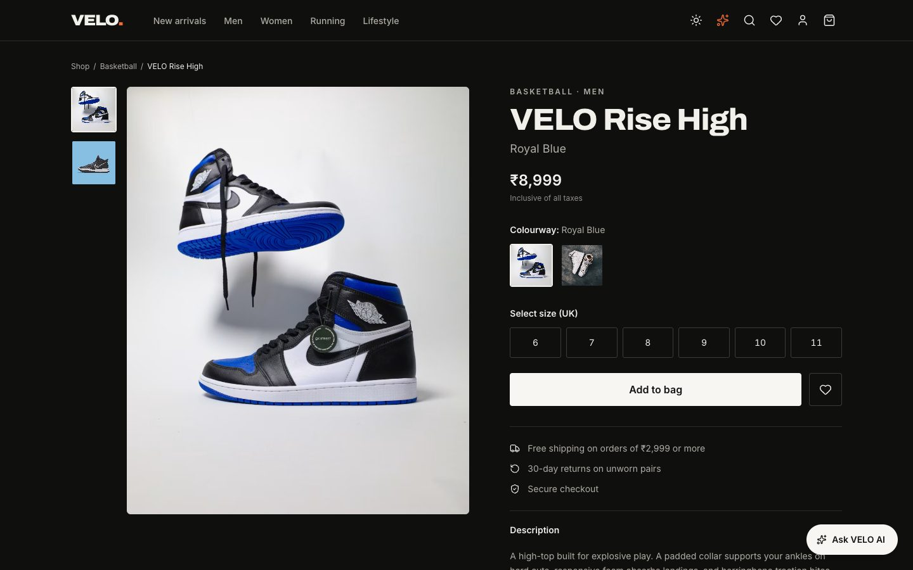
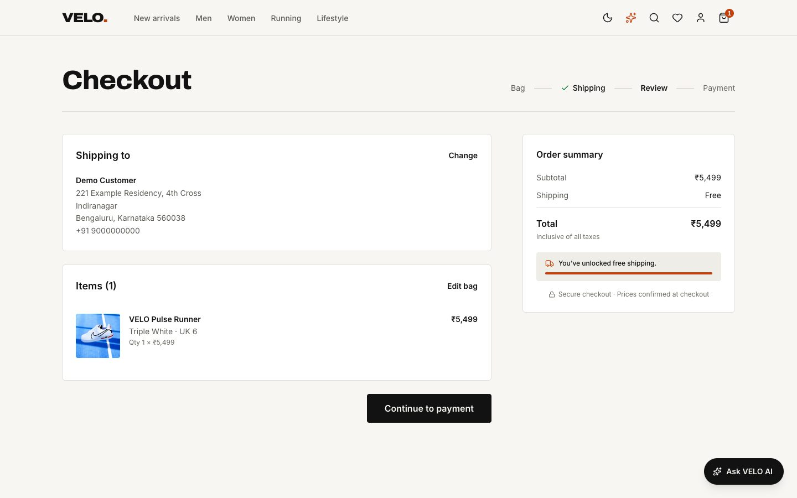

# VELO

**A premium sneaker store with an AI shopping assistant**: a full-stack ecommerce platform
with a storefront, admin, REST API and PostgreSQL, running entirely on your machine.


<table>
  <tr>
    <td width="50%"></td>
    <td width="50%"></td>
  </tr>
  <tr>
    <td></td>
    <td></td>
  </tr>
</table>

## Features

**Storefront.** A catalogue with filters, full-text search and facets; product pages with
colourways and UK sizes; a wishlist; a bag with a free-shipping progress bar; four-step checkout
(payment is simulated); order history with cancellation; light, dark and system themes.

**AI shopping assistant.** Describe what you want, for example _"gym shoes for my sister around
6k"_, then _"any cheaper?"_, and get real catalogue products with reasons. It runs on a **free,
open model on your laptop** (Ollama), and works without one in smart-search mode. The model can
only choose from products the server retrieved, and every sentence it writes is fact-checked.

**Admin.** A revenue dashboard; a product editor with drag-and-drop image upload, sizes, SKUs and
stock; categories; inventory alerts; order fulfilment with enforced status transitions; user
roles.

**Built to be trusted.** The server owns every price, total and stock decision. Checkout is one
database transaction with idempotency and row locking. Sessions use httpOnly cookies. The whole
app meets WCAG AA contrast, is keyboard-accessible and works at phone size.

## Tech stack

| Layer    | Technology                                                                                                  |
| -------- | ----------------------------------------------------------------------------------------------------------- |
| Client   | React 19, TypeScript, Vite, Tailwind CSS v4, React Router, TanStack Query, Zustand, React Hook Form, Zod    |
| Server   | Node.js, Express 5, TypeScript, Zod, Helmet, express-rate-limit, JWT (httpOnly cookie), bcrypt, multer      |
| Database | PostgreSQL (raw parameterised SQL with node-postgres, plain SQL migrations)                                 |
| AI       | Ollama with `qwen2.5:3b` (local, open), a provider abstraction (Ollama, OpenAI-compatible, rules-only mock) |
| Quality  | Vitest, Supertest, Testing Library, Playwright, axe-core, ESLint, Prettier                                  |

## Quick start

Needs Node.js ≥ 22.22 and PostgreSQL ≥ 13. The full guide, with troubleshooting, is
[docs/development/setup.md](docs/development/setup.md).

```bash
npm install

psql -d postgres -c "CREATE ROLE velo WITH LOGIN PASSWORD 'velo_dev_password';"
createdb -O velo velo_dev && createdb -O velo velo_test && createdb -O velo velo_e2e

cp server/.env.example server/.env      # then set JWT_SECRET (openssl rand -base64 48)
cp client/.env.example client/.env

npm run db:migrate && npm run db:seed
npm run dev
```

Open **http://localhost:5173**. The API runs at http://localhost:5001/api/v1.

| Account  | Email              | Password         |
| -------- | ------------------ | ---------------- |
| Admin    | `admin@velo.local` | `VeloAdmin#2026` |
| Customer | `user@velo.local`  | `VeloUser#2026`  |

These are local development accounts only. To turn on the local AI model, see
[setup step 6](docs/development/setup.md#6-optional-local-ai-model).

## Commands

| Command              | What it does                                                               |
| -------------------- | -------------------------------------------------------------------------- |
| `npm run dev`        | API and client together, in watch mode                                     |
| `npm run build`      | Production build of both workspaces                                        |
| `npm run typecheck`  | TypeScript check across the repo                                           |
| `npm run lint`       | ESLint (`npm run format` runs Prettier)                                    |
| `npm test`           | API and client test suites                                                 |
| `npm run test:e2e`   | Browser tests on an isolated database (`test:e2e:report` opens the report) |
| `npm run db:migrate` | Apply pending migrations (`db:status` shows them)                          |
| `npm run db:seed`    | Load demo data into an empty database                                      |
| `npm run db:reset`   | Drop, migrate and re-seed the development database                         |

## Documentation

| Document                                                          | Contents                                                               |
| ----------------------------------------------------------------- | ---------------------------------------------------------------------- |
| [Setup guide](docs/development/setup.md)                          | Install, environment variables, local AI, troubleshooting              |
| [Architecture](docs/architecture.md)                              | System diagram, backend layers, checkout and AI flows, frontend, theme |
| [Security](docs/security.md)                                      | Threats, controls and the tests that prove them                        |
| [Key decisions](docs/decisions.md)                                | Why paise, raw SQL, cookies, a local model and more                    |
| [Testing & QA](docs/development/testing.md)                       | Test suites, databases, QA findings                                    |
| [API reference](docs/api/README.md)                               | Every endpoint, with request and response examples                     |
| [Database](docs/database/schema.md) · [setup](database/README.md) | Schema design, migrations, seed data                                   |
| [Backend conventions](docs/development/backend-conventions.md)    | How modules, validation, errors and logging are structured             |
| [Case study](docs/case-study.md)                                  | The project as a portfolio write-up                                    |

## Project structure

```
velo/
├── client/              React storefront + admin (src/components, pages, hooks, services, store, styles)
├── server/              Express API (src/modules/<feature>, src/middleware, tests/)
├── database/            SQL migrations + JSON seed data
├── e2e/                 Playwright end-to-end tests
├── docs/                Architecture, security, API, testing, screenshots
├── playwright.config.ts
└── package.json         npm workspaces + root scripts
```

## Scope

VELO is a portfolio project that runs locally. Payments are simulated and no card or UPI data is
collected. Hosting is intentionally out of scope.

## Image credits

Product and category photography comes from [Unsplash](https://unsplash.com) under the
[Unsplash License](https://unsplash.com/license). VELO is a fictional brand. Some photos show real
third-party products and logos and are used only as placeholder imagery for this portfolio
project; replace them with original photography before any real use.
