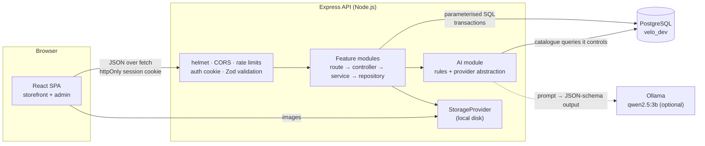
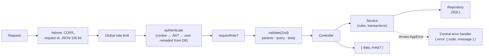
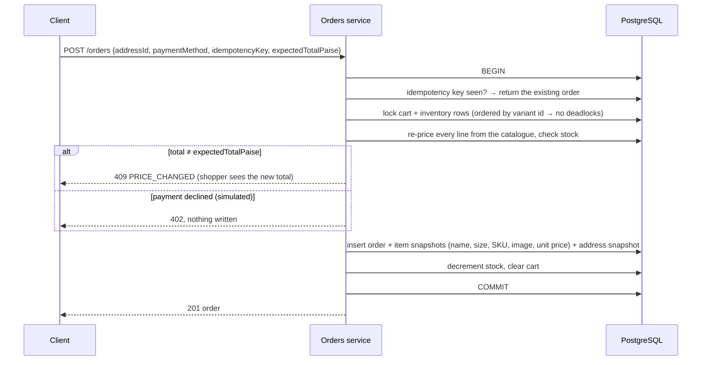
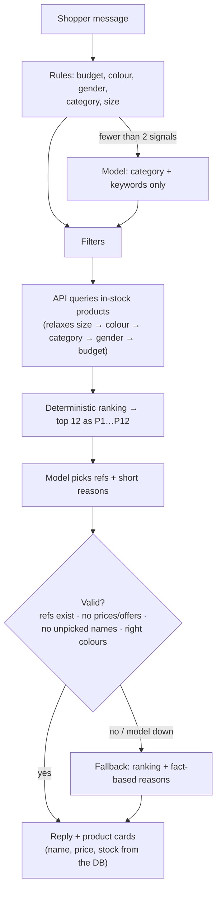

# Architecture

VELO is a TypeScript monorepo (npm workspaces): a React single-page app, an Express API and a
PostgreSQL database, plus an optional local language model for the shopping assistant.

## System overview



| Concern                      | Where it lives                                                                                           |
| ---------------------------- | -------------------------------------------------------------------------------------------------------- |
| Prices, totals, stock, roles | **Only the API.** The client sends ids and quantities; it never sends prices.                            |
| Access control               | API middleware (`authenticate`, `requireRole('ADMIN')`). Client route guards only decide what to render. |
| Data integrity               | PostgreSQL constraints (CHECKs, unique keys, foreign keys) as the final guard.                           |
| AI output                    | Validated and fact-checked by the API before any of it reaches the shopper.                              |

## Backend

### Request lifecycle



- **Layers**: routes wire middleware, controllers translate HTTP, services hold the business rules
  and transactions, and repositories contain the only SQL. The full conventions are in
  [development/backend-conventions.md](development/backend-conventions.md).
- **Responses**: success is `{ data, meta? }`; errors are `{ error: { code, message, details? } }`
  from one error handler. Unexpected errors become a generic 500 with a request id, and the
  details go to the server log only.
- **Validation**: every param, query and body passes through a Zod schema; unknown fields are
  dropped.
- **SQL**: raw, parameterised queries with node-postgres, with no ORM. Plain SQL migrations are
  applied by a small migrator that keeps checksums and takes an advisory lock.

### Modules

```
server/src/modules/
  auth, users, addresses        accounts, sessions, profile, saved addresses
  categories, products          public catalogue (filters, full-text search, facets)
  cart, wishlist, orders        shopping flow; pricing in cart.pricing.ts
  admin/                        dashboard, products (+ uploads), categories, inventory, orders, users
  ai/                           providers · prompts · schemas · services
  health                        liveness + database check
```

### Commerce rules

Configured in `server/src/config/commerce.ts`:

| Rule               | Value                              |
| ------------------ | ---------------------------------- |
| Currency           | INR, stored as **integer paise**   |
| Shipping           | Free from ₹2,999, otherwise ₹99    |
| Per line / per bag | Up to 10 of a size, up to 20 lines |

- **Cart**: stores variant ids and quantities only. Every read re-prices from the catalogue and
  checks stock, and lines that are sold out or over stock are flagged and excluded from totals.
- **Guest bag**: lives in `localStorage` as ids and quantities, is priced by `POST /cart/quote`,
  and is merged into the account on sign-in (`POST /cart/merge`). The merge reports anything it
  had to change, and the client shows that as a notice.
- **Wishlist**: signed-in only, with optimistic updates in the UI. A guest who taps the heart is
  asked to sign in, and the product is saved afterwards.

### Placing an order

One database transaction. The shopper either gets exactly one correct order, or nothing
changes.



- **Status flow**: `CONFIRMED → PROCESSING → SHIPPED → DELIVERED`, enforced by a transition map.
  Customers can cancel while an order is `CONFIRMED`, and admins can cancel until it ships.
  Cancelling restocks the items and marks paid orders as refunded, in the same transaction.
- **History is frozen**: orders keep the price, product details and address from purchase time.

### AI shopping assistant



- The model **never touches the database** and can only choose from products the API has
  already retrieved. Explicit constraints come from the shopper's words, not the model.
- Providers (`ai/providers`) all implement one interface, `generateJson({ messages, schema })`:
  Ollama (local, JSON-schema-constrained output), any OpenAI-compatible API, and a mock provider
  that always falls back to rules. Switching provider is an env change (`AI_PROVIDER`).
- An AI failure never fails the request. API details are in [api/ai.md](api/ai.md).

### Images

Admins upload JPEG, PNG or WebP files of up to 5 MB. The type is checked from the **file's
bytes**, not its name. Files are stored through a `StorageProvider` interface (local disk today)
under random UUID keys, served from `/uploads` with `nosniff`, a locked-down CSP and immutable
caching, and deleted once no product or category references them.

## Frontend

| Concern        | Approach                                                                                                                                                                                                                                                                    |
| -------------- | --------------------------------------------------------------------------------------------------------------------------------------------------------------------------------------------------------------------------------------------------------------------------- |
| Routing        | React Router data router, `client/src/routes/router.tsx`; every URL comes from `routes/paths.ts`                                                                                                                                                                            |
| Code-splitting | Only the home page ships in the first load. Other pages load on demand (`storefrontPages.ts`, `adminPages.ts`), and popular ones are prefetched when the browser is idle. Named vendor chunks (`vendor-react`, `vendor-query`, `vendor-forms`) stay cached between releases |
| Server state   | TanStack Query: feature calls in `services/`, hooks in `hooks/`, one typed `apiClient` (cookies, `ApiError`)                                                                                                                                                                |
| Client state   | Zustand: guest bag (persisted, sanitised on load), UI state, theme                                                                                                                                                                                                          |
| Forms          | React Hook Form + Zod. The schemas mirror the server rules for instant feedback, and the server re-validates                                                                                                                                                                |
| Guards         | `RequireAuth`, `RequireAdmin`, `GuestOnly`: UX only, with `safeRedirect` preventing open redirects after sign-in                                                                                                                                                            |
| Accessibility  | Semantic HTML, native `<dialog>` for drawers (focus trap, Escape), skip link, live regions; axe scan in CI-style e2e tests                                                                                                                                                  |

```
client/src/
  components/   common (Button, Input, Drawer, Alert…), layout, product, cart, checkout, assistant, admin
  pages/        one folder per area; each page sets its <title>
  layouts/      Root, Storefront, Account, Admin
  hooks/ services/ store/ lib/ config/ schemas/ types/ utils/
  styles/       theme.css — the design tokens
```

### Theme

All colour, type and shape decisions live in `client/src/styles/theme.css` as semantic tokens:
`canvas`, `surface`, `ink`, `ink-muted`, `ink-subtle`, `line`, `accent` ("Ember" `#C2410C`),
`inverse`, `band`, and the status colours. Tailwind's default palette is reset, so off-brand
classes such as `bg-blue-500` don't exist.

- **Dark mode**: the same tokens are redefined under `:root[data-theme='dark']`. Shoppers choose
  Light, Dark or System. The choice is stored per browser and applied by a small script in
  `index.html` before first paint, so there's no flash.
- `inverse` flips with the theme (primary buttons, selected states); `band` stays dark in both
  themes (footer, sign-in panel).
- Every text token reaches at least **4.5:1 contrast** on every surface in both themes (WCAG AA),
  and the end-to-end accessibility scan checks this.
