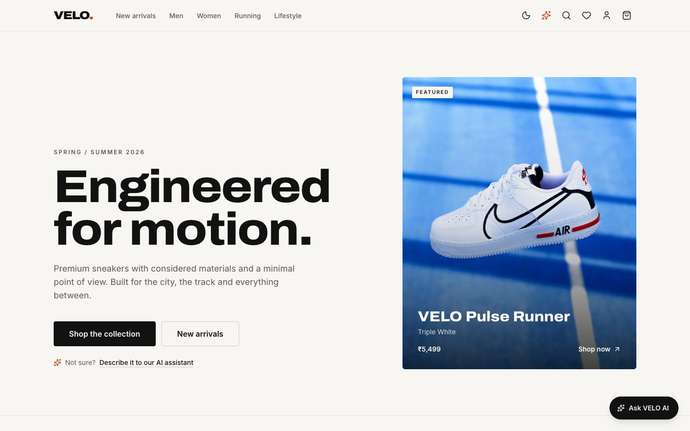
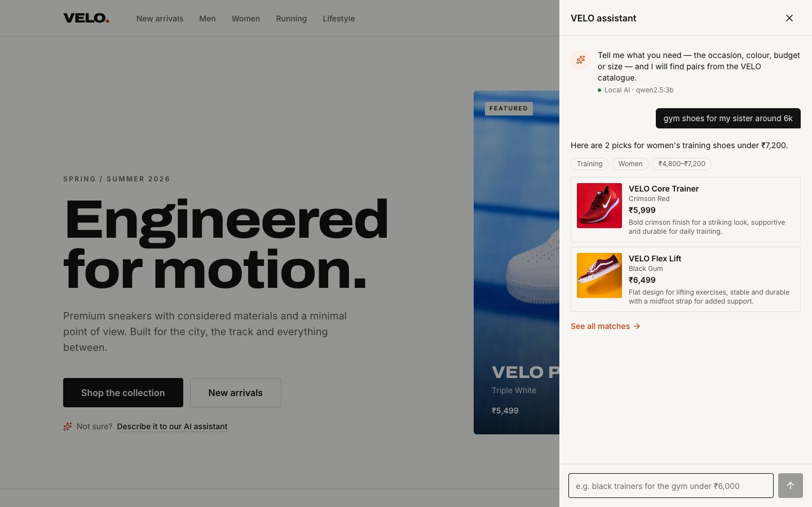
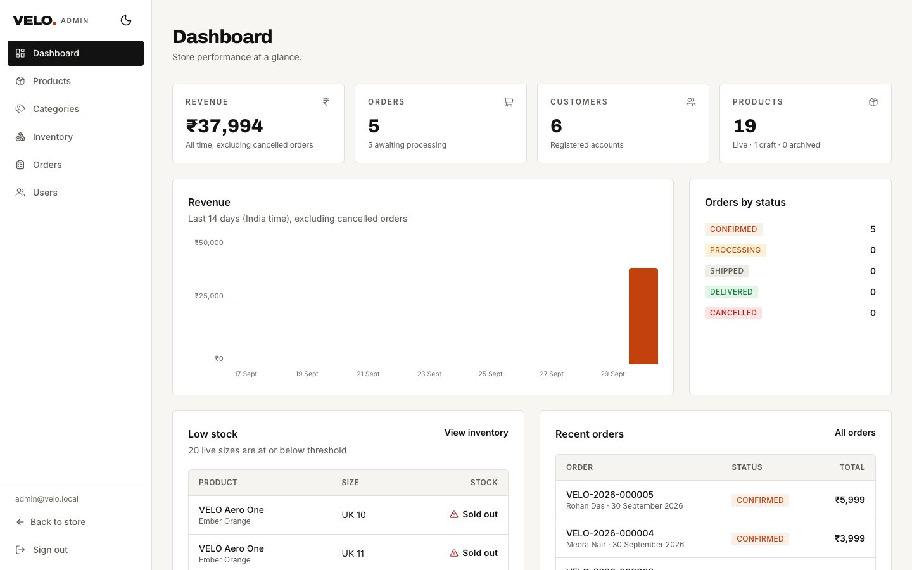

# Case study: VELO

**A premium sneaker store with an AI shopping assistant, built end to end: storefront, admin,
API, database and tests.**

## The brief

Build a portfolio-grade ecommerce platform for a fictional sneaker brand: a premium, editorial
storefront; real accounts, bag, checkout and order history; an admin area for products,
inventory and orders; and an AI assistant that helps shoppers find a pair. It had to be secure
by default, accessible, and run entirely on a laptop.

## What I built

| Area       | Highlights                                                                                                                                                                                         |
| ---------- | -------------------------------------------------------------------------------------------------------------------------------------------------------------------------------------------------- |
| Storefront | Catalogue with filters, full-text search and facets; product pages with colourways and UK sizes; bag drawer with a free-shipping progress bar; four-step checkout; order history with cancellation |
| Admin      | Revenue dashboard with a 14-day chart; product editor with drag-and-drop image upload, sizes, SKUs and stock; inventory alerts; order fulfilment with enforced status transitions; user roles      |
| AI         | "Ask VELO AI" understands requests like _"gym shoes for my sister around 6k"_, then _"any cheaper?"_, and answers with real catalogue products, running on a free open model on the laptop         |
| Design     | A token-based theme ("Ember" accent) with light, dark and system modes, WCAG AA contrast and a fully responsive layout                                                                             |

## Engineering highlights

**Correct money, always.** Prices are integer paise and are decided only by the server. Placing
an order is one PostgreSQL transaction: it locks the bag and stock rows in a fixed order,
re-prices every line, snapshots the product and address, decrements stock and clears the bag.
An idempotency key makes double-clicks harmless, and if a price changes between review and
payment, the shopper is shown the new total instead of being charged it. Tests prove that two
customers racing for the last pair can't both win.

**An assistant that can't make things up.** Small local models get numbers and facts wrong, so
the model is never in charge of them. Deterministic rules read the budget, colour, gender and
size; the API retrieves real in-stock products; the model only picks from a numbered list of
those products and writes a short reason. Every sentence is fact-checked: text that mentions
prices, offers, internal references, products it didn't pick, or the wrong colour is replaced
with copy built from database facts. If the model is slow or down, the same answer comes from
the rules. Testing against the live model exposed invented filters, leaked references and a
partly successful prompt injection, and each became a guardrail with a regression test.

**Security as tests, not claims.** The security suite reads route lists from the routers
themselves, so every admin endpoint, including future ones, is checked for 401 and 403. It also
covers IDOR, mass assignment, client-sent prices, forged JWTs, SQL-injection payloads and path
traversal. See [security.md](security.md).

**Fast by default.** Only the home page ships in the first load. Everything else is code-split,
and popular pages are prefetched when the browser is idle. The first visit dropped from 185 kB
to 131 kB of gzipped JavaScript.

## Quality

| Suite                 | Tests | Notes                                                                                                     |
| --------------------- | ----- | --------------------------------------------------------------------------------------------------------- |
| API (real PostgreSQL) | 218   | 94% statement coverage                                                                                    |
| Client                | 47    | Logic, stores and key components                                                                          |
| End-to-end (browser)  | 24    | Full journey on desktop and phone, access control, keyboard-only use, axe WCAG 2.1 AA scan in both themes |

The QA pass found and fixed four real defects: a crash on NUL characters, an open redirect via
tab characters, sub-AA contrast on secondary text, and a sign-in form that swallowed the first
click. The findings are listed in [development/testing.md](development/testing.md).

## Stack

React 19, TypeScript, Vite, Tailwind CSS v4, TanStack Query, Zustand, React Hook Form, Zod ·
Node.js, Express 5, PostgreSQL 18 (raw SQL), JWT in httpOnly cookies, bcrypt · Ollama
(`qwen2.5:3b`) · Vitest, Supertest, Testing Library, Playwright, axe-core.

## What I'd build next

- A real payment gateway in test mode, with webhooks driving the payment status.
- Email verification and password reset.
- Typo-tolerant search (trigram similarity) and "complete the look" recommendations.
- Product reviews with moderation in the admin area.
