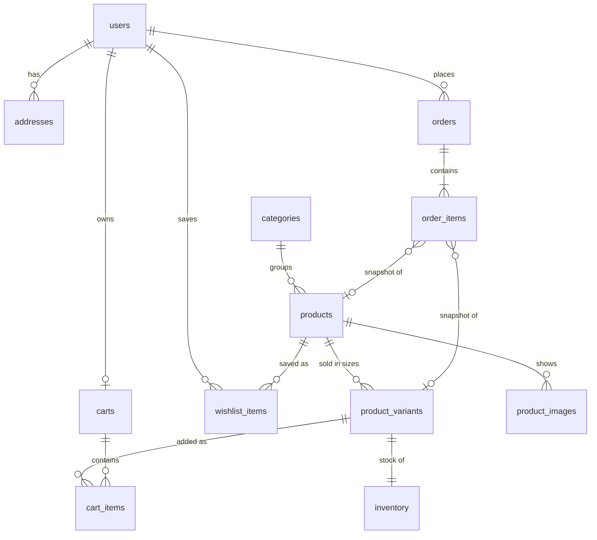

# Database schema

Source of truth: [`database/migrations/`](../../database/migrations). This page explains the
design; the SQL is authoritative.

## Entity relationships

## Tables

| Table               | Purpose                      | Key rules                                                                                            |
| ------------------- | ---------------------------- | ---------------------------------------------------------------------------------------------------- |
| `users`             | Accounts                     | Email unique case-insensitively; `role` is `USER`/`ADMIN`; `token_version` revokes issued JWTs       |
| `addresses`         | Saved shipping addresses     | At most one `is_default` per user (partial unique index)                                             |
| `categories`        | Catalogue groups             | URL-safe unique `slug`                                                                               |
| `products`          | A product in one colourway   | `price_paise > 0`; `compare_at_price_paise` must exceed price; `status` DRAFT/ACTIVE/ARCHIVED        |
| `product_variants`  | One size of a product        | Unique `sku`; unique `(product_id, size_label)`; optional `price_override_paise`                     |
| `inventory`         | Stock per variant (1:1)      | `quantity >= 0`; `low_stock_threshold` drives admin alerts                                           |
| `product_images`    | Gallery images               | Ordered by `sort_order`; `alt_text` required (accessibility)                                         |
| `wishlist_items`    | Saved products               | Primary key `(user_id, product_id)` — one wishlist per user                                          |
| `carts`             | One cart per signed-in user  | Parent table kept for future server-side guest carts                                                 |
| `cart_items`        | Variant + quantity in a cart | Quantity 1–10; unique `(cart_id, variant_id)`. **No prices stored** — always recalculated            |
| `orders`            | Placed orders                | `total = subtotal + shipping` (CHECK); address stored as a JSON snapshot; `idempotency_key` per user |
| `order_items`       | Order lines                  | Name, colourway, size, SKU, image and **unit price copied at purchase**; `line_total = unit × qty`   |
| `schema_migrations` | Applied migrations           | Managed by the migration runner                                                                      |

## Design decisions

- **Money in paise (integers).** ₹5,499 is stored as `549900`. No floating-point rounding errors.
  The API converts for display; the client never sends prices.
- **Colour vs colourway.** `color` is a normalised family (`white`, `black`, …) used by filters and
  the AI assistant; `colorway` is the marketing name ("Triple White"). Each colourway is its own
  product, and variants are sizes only.
- **Availability is derived**, not stored: a variant can be bought when
  `is_active AND inventory.quantity > 0`. There is no `availability` column to drift out of sync.
- **Order history is immutable.** Order items copy everything they display. Product FKs use
  `ON DELETE SET NULL`, so even a hard-deleted product never breaks an old order. Products are
  normally archived rather than deleted.
- **Order numbers** (`VELO-2026-000123`) come from a sequence; the UUID stays the internal key.
- **Full-text search** uses a generated, weighted `tsvector` (name › colourway/colour › material ›
  description) with a GIN index. Tags have their own GIN index for `tags @> '{running}'` queries.
- **Case-insensitive email uniqueness** via a unique index on `lower(email)` — no `citext`
  extension, so it runs on any PostgreSQL host.
- **`updated_at`** is maintained by a trigger, not application code.
- **Portability.** Only built-in PostgreSQL 13+ features (`gen_random_uuid()`, `tsvector`, enums,
  generated columns), so the migrations run unchanged on Supabase.
